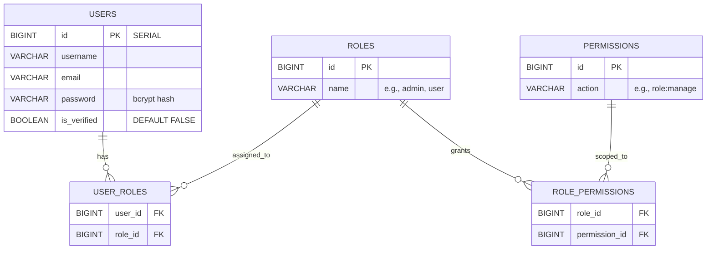
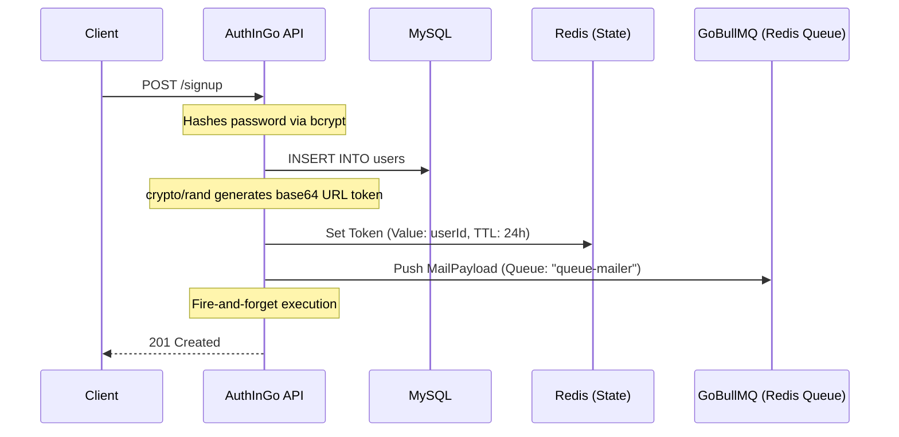

# 🔐 AuthInGo (Authentication & API Gateway)

AuthInGo is the front door to the microservices ecosystem. Built in Go, it handles user identity, a normalized 5-table Role-Based Access Control (RBAC) system, and serves as the foundational **API Gateway** using Go's native reverse proxy capabilities.

## 🏗 Key Architectural Decisions

- **Raw SQL & Goose:** Built with `database/sql` (no ORM) for maximum execution speed, with schema migrations managed by [Goose](https://github.com/pressly/goose).
- **Proper RBAC Normalization:** Roles and permissions are completely decoupled from the user record, utilizing a 5-table Many-to-Many architecture to allow fine-grained access control (e.g., `user:read`, `role:manage`).
- **Fire-and-Forget Asynchronous Queues:** Utilizes `GoBullMQ` (a Redis-backed queue) to dispatch email verification jobs asynchronously. If the queue push fails, the API gracefully degrades (logging the error) but still returns a `201 Created` to prevent blocking the user's registration flow.
- **API Gateway Foundation:** Implements `httputil.NewSingleHostReverseProxy` to route traffic to downstream services (currently proxying to `FakeStoreAPI` as a proof-of-concept).

---

## 🗄 Database Schema (RBAC ERD)

---

## 🔄 User Registration & Async Email Flow

---

## 📖 API Reference

### 👤 Identity & Auth
| Method | Path | Auth Required | Description |
|--------|------|---------------|-------------|
| `POST` | `/signup` | None | Registers a user and enqueues a verification email job. |
| `POST` | `/login` | None | Validates credentials and returns a raw **JWT string** signed with `HS256`. |
| `GET` | `/verify` | None | Validates the email token via Redis (`?token=...`). |
| `GET` | `/profile` | JWT + `user` | Returns the authenticated user's profile. |

### 🛡️ RBAC Management
| Method | Path | Description |
|--------|------|-------------|
| `GET` / `POST` | `/roles` | List all roles or create a new role. |
| `PUT` / `DELETE` | `/roles/{id}` | Update or delete a specific role. |
| `GET` / `POST` / `DELETE`| `/roles/{id}/permissions` | Manage permissions assigned to a specific role. |
| `POST` | `/roles/{userId}/assign/{roleId}` | **[Admin]** Assigns a role to a specific user. |

### 🚪 API Gateway (Reverse Proxy)
| Method | Path | Description |
|--------|------|-------------|
| `ANY` | `/fakestoreservice/*` | Proof-of-concept reverse proxy. Strips prefix and proxies request transparently to upstream server. |

---
