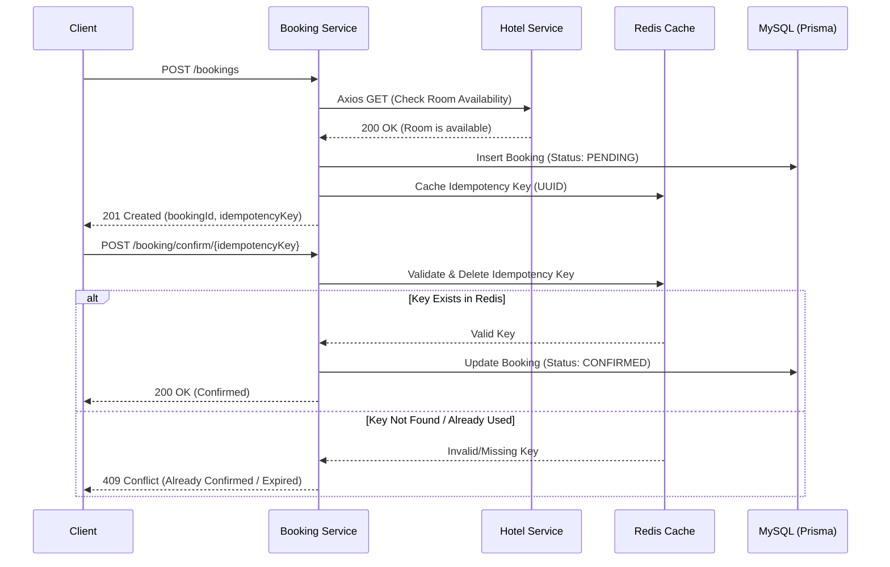

# API Reference & Booking Flow

The Booking Service utilizes a **Two-Phase Booking Pattern** (Initiate -> Confirm) and leverages **Redis** as a distributed cache to ensure idempotency during the confirmation phase, preventing race conditions and double-bookings.

### 1. Initiate Booking
`POST /api/v1/bookings`

Initiates a new hotel reservation with a `PENDING` status. Before creating the record, it synchronously checks the `HotelService` for date availability. It generates an idempotency key (UUID), caches it in Redis, and returns it to the client for the confirmation step.

> **⚠️ Future Roadmap:** In later versions, `userId` will be injected via the API Gateway JWT, and `bookingAmount` will be calculated securely on the backend via the `HotelService`.

**Request Body:**
```json
{
   "userId": 2,
   "hotelId": 6,
   "totalGuests": 5,
   "bookingAmount": 5500,
   "roomCategoryId": 1,
   "checkInDate": "2026-10-30",
   "checkOutDate": "2026-10-31"
}
```

**Success Response (201 Created):**
```json
{
    "bookingId": 2,
    "idempotencyKey": "98b16752-b4a4-4fe8-b8fd-19d8b267a1ab"
}
```

---

### 2. Confirm Booking
`POST /api/v1/booking/confirm/:idempotencyKey`

Finalizes the booking (often after payment success). The service checks the provided idempotency key against the **Redis distributed cache** to guarantee the confirmation logic executes exactly once, even if the client retries the request.

**Path Parameters:**
- `idempotencyKey`: The UUID returned from the Initiate endpoint.

**Success Response (200 OK):**
```json
{
    "bookingId": 2,
    "idempotencyKey": "CONFIRMED"
}
```

---

### 🔄 Distributed System Flow Diagram

