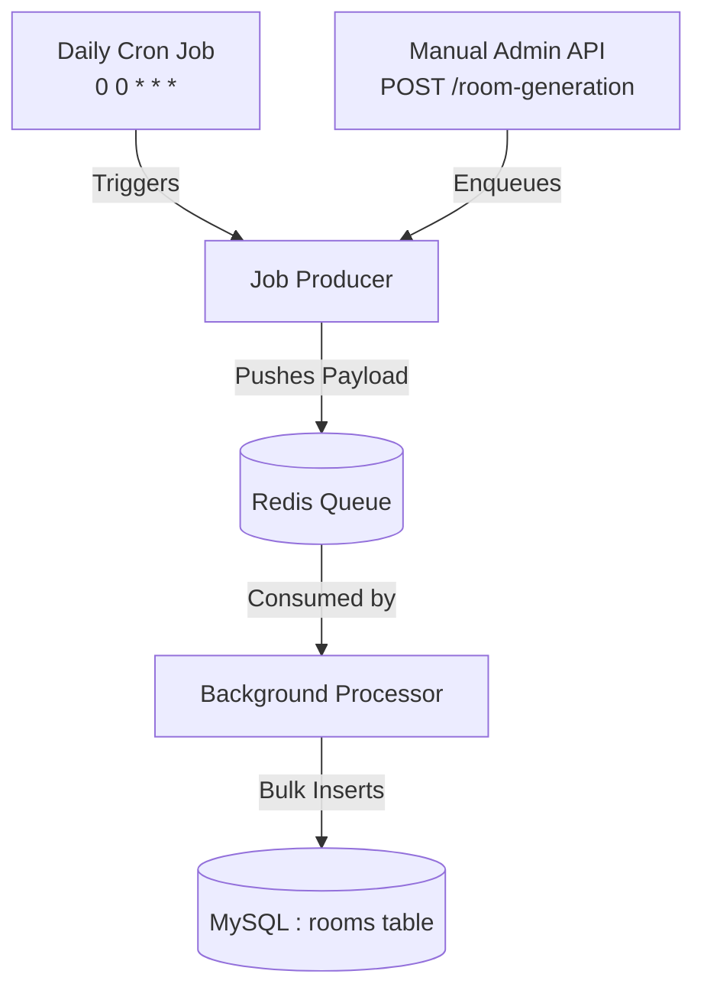

# Hotel Service

The Hotel Service is a core domain microservice responsible for managing hotel properties, room classifications, pricing tiers, and granular daily room inventory.

Built with Node.js, TypeScript, and Sequelize (MySQL), it is designed to handle high-read traffic for availability checks and utilizes asynchronous Redis queues to handle heavy database writes without blocking the main event loop.

## 🏗 Key Architectural Decisions

- **Database-per-Service:** Operates on an isolated MySQL database to enforce microservice boundaries.
- **Granular Availability Pattern:** Instead of calculating availability on the fly, the service maintains a daily availability ledger (`rooms` table) linked to room categories, enabling fast `O(1)` or indexed date-range lookups.
- **Soft Deletes:** Implements Sequelize's paranoid mode (`paranoid: true`) to support soft deletions (`deletedAt`) for data auditing and integrity.
---
### Architecture Flow



### 1. The Producer
Jobs are pushed to the Redis queue either automatically by the midnight Cron Job (`0 0 * * *`) or manually via the Admin API.

**Queue Payload Schema:**
```typescript
{
    roomCategoryId: number;
    startDate: string;      // YYYY-MM-DD
    endDate: string;        // YYYY-MM-DD
    batchSize: number;      // Controls chunking for memory safety
    priceOverride?: number; // Optional seasonal pricing adjustments
}
```

### 2. The Processor (Worker)
A dedicated worker listens to the Redis queue, picks up the payload, and executes the bulk inserts into the MySQL `rooms` table in safe batch sizes. This ensures the main API remains highly responsive even when generating thousands of future availability rows.

---

## 📖 API Reference

### 🌐 Public APIs (Discovery)
Endpoints consumed by the frontend/API Gateway for user navigation.

- **`GET /api/v1/hotels`**: Retrieves a list of all active hotels.
- **`GET /api/v1/hotels/:id`**: Fetches details for a specific hotel (address, location, rating).

### 🛡️ Admin APIs (Management)
Protected endpoints used by hotel managers or system admins.

- **`POST /api/v1/hotels`**: Onboards a new hotel property.
- **`PUT /api/v1/hotels/:id`**: Updates existing hotel details.
- **`DELETE /api/v1/hotels/:id`**: Soft-deletes a hotel property, preserving past booking data.

### ⚙️ System & Automation APIs (Inventory)
- **`POST /api/v1/room-generation`**
  - **Purpose:** Acts as a manual administrative trigger to enqueue a bulk room-generation job into the Redis queue. It does not block the request while rooms are generated, returning a success response immediately once the job is dispatched.

---

## 🔄 Inter-Service APIs (Consumed by Booking Service)

Internal endpoints used exclusively by the `BookingService` to coordinate the two-phase reservation flow.

### 1. Check Room Availability
`GET /api/v1/rooms/available`

Queries the pre-generated daily room inventory to verify if a room category is free between the requested dates.

**Query Parameters:**
- `roomCategoryId`: `number`
- `checkInDate`: `string` (YYYY-MM-DD)
- `checkOutDate`: `string` (YYYY-MM-DD)

**Success Response (200 OK):**
```json
{
    "available": true,
    "hotelId": 6,
    "roomCategoryId": 1
}
```

### 2. Lock Inventory (Update Booking ID)
`POST /api/v1/rooms/update-booking-id`

Locks the inventory. Once a booking is initiated, this endpoint updates the specific daily room rows for the date range, changing their `bookingId` from `null` to the active reservation ID, thereby preventing double-bookings.

**Request Body Schema:**
- Passes the newly created `bookingId` and matching room inventory criteria.

**Success Response (200 OK):**
```json
{
    "message": "Room inventory successfully locked for booking",
    "updatedRows": 2
}
```

---

---

## 🗄 Database Schema (ERD)

The relational schema maps hotels to their respective room categories and individual daily inventory slots.

```mermaid
erDiagram
    HOTEL ||--o{ ROOM_CATEGORY : contains
    HOTEL ||--o{ ROOM : tracks
    ROOM_CATEGORY ||--o{ ROOM : classifies

    HOTEL {
        int id PK
        string name
        string address
        string location
        float rating
        int rating_count
        datetime created_at
        datetime updated_at
        datetime deleted_at
    }

    ROOM_CATEGORY {
        int id PK
        int hotelId FK
        enum roomType "SINGLE, DOUBLE, FAMILY, DELUXE, SUITE"
        decimal price
        int roomCount
        datetime created_at
        datetime updated_at
        datetime deleted_at
    }

    ROOM {
        int id PK
        int hotelId FK
        int roomCategoryId FK
        int bookingId "Soft FK -> BookingService (Nullable)"
        datetime dateOfAvailability
        decimal price
        datetime created_at
        datetime updated_at
        datetime deleted_at
    }


