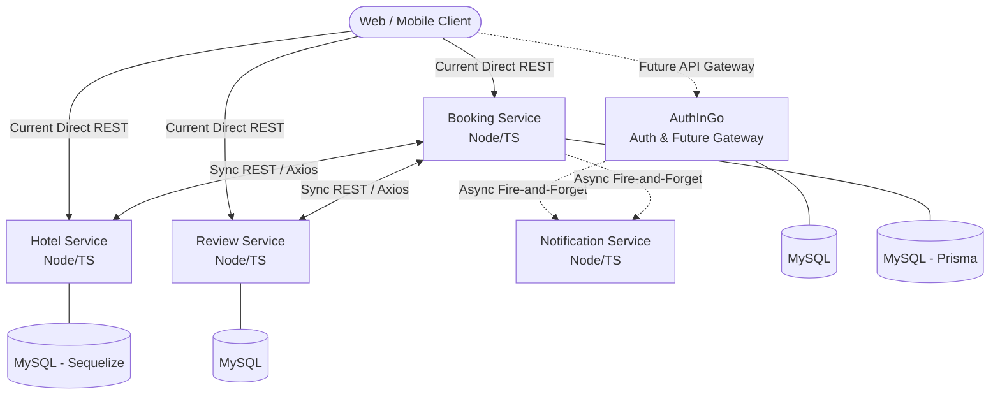

# Hotel Booking Microservices System

[]()
[]()
[]()
[](https://golang.org)

A robust, highly scalable backend system for a hotel booking platform built using a microservices architecture. The system is divided into five independent domain services, utilizing Node.js/Express (TypeScript) and MySQL via Prisma/Sequelize ORMs and GoLang.

This project demonstrates distributed system design, synchronous service-to-service communication via REST, and asynchronous event handling for non-blocking operations.

## 🏗 System Architecture

The application is currently transitioning to a centralized API Gateway pattern. While `AuthInGo` currently handles authentication (and is evolving to route all incoming traffic), clients currently interact with the domain services directly.

Service-to-service communication is handled via synchronous Axios HTTP calls for critical domain logic, while the `NotificationService` operates asynchronously to ensure email/SMS dispatching does not block core user flows.

### Architecture Diagram



## 🧩 Services Overview

| Service | Responsibility | Communication Status |
|---------|----------------|----------------------|
| **`AuthInGo`** | User authentication, JWT issuance, and upcoming API Gateway. | Sync (Ingress) / Async (to Notifications) |
| **`HotelService`** | Manages hotel inventory, room types, and availability. | Sync via Axios |
| **`BookingService`** | Handles reservation lifecycle, checking availability with Hotel. | Sync (to Hotel) / Async (to Notifications) |
| **`ReviewService`** | Manages user feedback and hotel ratings. | Sync via Axios |
| **`NotificationService`**| Dispatches emails/alerts for registrations and bookings. | Async (Receiver) |


## 🚀 Local Development Setup

Currently, the services are run individually via the terminal. To get the entire microservices ecosystem running locally, follow these steps.

### Prerequisites
- [Node.js](https://nodejs.org/) (v16 or higher)
- [Go](https://go.dev/) (for the `AuthInGo` service)
- [MySQL](https://www.mysql.com/) (running locally or via Docker)

### 1. Clone the Repository
```bash
git clone [https://github.com/Ayhampt/Hotel-Booking-Application.git](https://github.com/Ayhampt/Hotel-Booking-Application.git)
cd Hotel-Booking-Application
```

### 2. Environment Configuration
Each service requires its own environment variables. Navigate into each service folder, copy the example `.env` file, and update it with your local MySQL credentials and JWT secrets.
```bash
# Example for Booking Service
cd BookingService
cp .env.example .env
```
*(Note: Ensure you do this for `HotelService`, `ReviewService`, `NotificationService`, and `AuthInGo` as well).*

### 3. Database Setup & Migrations
Because the services maintain their own database boundaries, you need to run migrations for the Node.js services utilizing ORMs.

**For Prisma (e.g., BookingService):**
```bash
cd BookingService
npx prisma migrate dev
```

**For Sequelize (e.g., HotelService):**
```bash
cd HotelService
npx sequelize-cli db:migrate
```

### 4. Running the Services
Open a separate terminal window/tab for each service and start them up:

**Terminal 1 (AuthInGo):**
```bash
cd AuthInGo
go run main.go
```

**Terminal 2, 3, 4, 5 (Node.js Services):**
```bash
# Run this command inside BookingService, HotelService, ReviewService, and NotificationService
npm install
npm run dev
```

> **💡 Future Enhancement:** The project is planned to be containerized using `docker-compose` to allow one-click orchestration of all services and databases.
