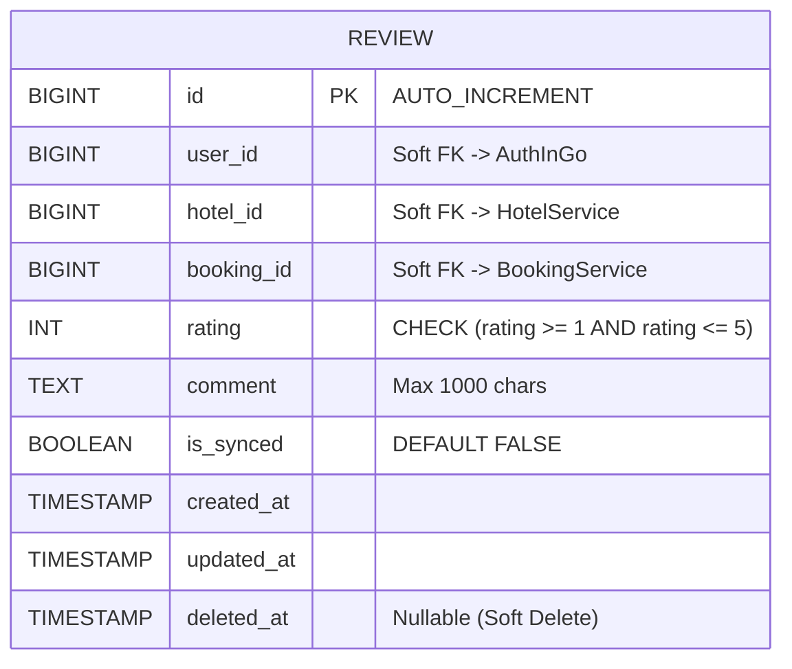
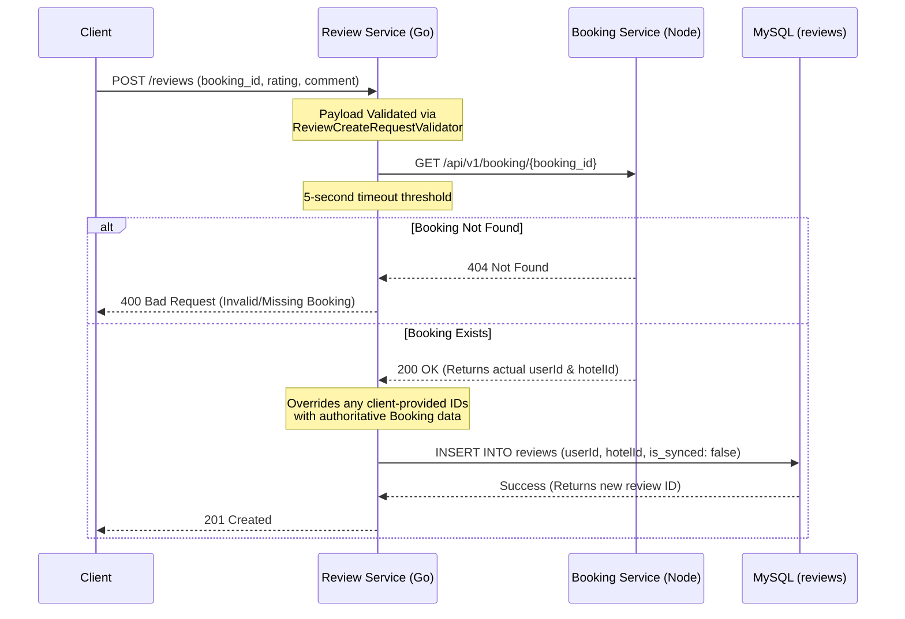

# ⭐ Review Service

The Review Service is a Go-based microservice responsible for managing user feedback and hotel ratings. It is designed with strict data integrity rules, ensuring that reviews can only be created against actual, verifiable bookings, while deferring heavy cross-service updates using an eventual consistency model.

## 🏗 Key Architectural Decisions

- **Raw SQL & Goose:** Built with Go and `database/sql` (no ORM) for maximum execution speed and memory efficiency. Database migrations are managed via [Goose](https://github.com/pressly/goose).
- **Verified Stays & Anti-Spoofing:** When a review is submitted, the service ignores client-provided user or hotel IDs. Instead, it makes a synchronous HTTP call to the `BookingService` using the provided `booking_id`. If the booking exists, it extracts the true `userId` and `hotelId` from the booking response, completely preventing users from spoofing reviews for properties they never booked.
- **Eventual Consistency (`is_synced` Flag):** To prevent slowing down the review submission process, updates to a hotel's overall average rating are not performed synchronously. Newly created reviews are flagged with `is_synced = FALSE`, scaffolding a lightweight **Outbox Pattern** for a future background worker to aggregate and push rating updates to the `HotelService` asynchronously.

---

## 🗄 Database Schema (ERD)

The database schema utilizes raw SQL constraints and soft foreign keys to maintain loose coupling with other microservices.



---

## 🔄 The "Verified Stay" Workflow

This sequence diagram illustrates the synchronous validation pattern used to enforce authentic reviews and extract untamperable relational IDs.



---

## 📖 API Reference

### 1. Submit a Review
`POST /reviews`

Creates a new review. The client only needs to provide the `booking_id`, the `rating`, and the `comment`. The system automatically derives the `user_id` and `hotel_id` by communicating with the `BookingService`.

**Request Body:**
```json
{
  "booking_id": 42,
  "comment": "Great stay, very clean! Highly recommend the breakfast.",
  "rating": 5
}
```

**Success Response (201 Created):**
```json
{
  "message": "Review submitted successfully",
  "review_id": 108
}
```

